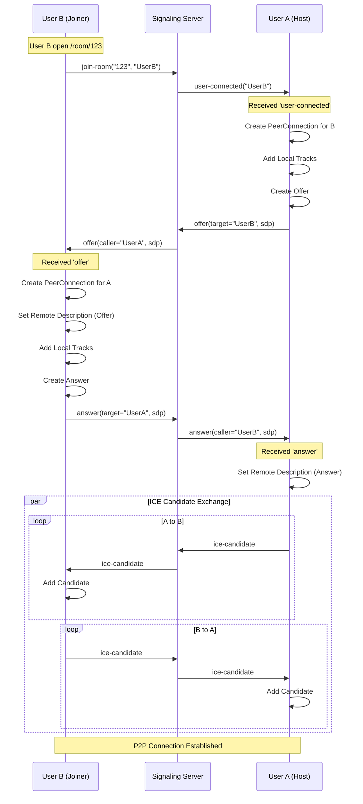

# Architecture Documentation

## System Overview
ConferCall uses a **Mesh Topology** (Peer-to-Peer) architecture. 
- **Signaling**: A centralized Node.js/Socket.io server facilitates the initial handshake (SDP Offer/Answer and ICE Candidates).
- **Media**: Video and Audio streams flow directly between peers (P2P) using WebRTC. No media passes through the server.
- **Frontend**: React application manages state, UI, and media streams.

## Architecture Diagram

### High-Level Architecture

```mermaid
graph TD
    UserA[User A Browser] <-->|WebRTC Media| UserB[User B Browser]
    UserA <-->|WebRTC Media| UserC[User C Browser]
    UserB <-->|WebRTC Media| UserC
    
    UserA -.->|Socket.io Signaling| Server[Signaling Server (Node.js)]
    UserB -.->|Socket.io Signaling| Server
    UserC -.->|Socket.io Signaling| Server
```

### Signaling Flow (Mesh Connection)

Diagram showing User B joining a room with User A.



## Component Architecture

### Frontend Components

1.  **App.jsx**
    - Router setup.
    - Manages navigation between RoomSetup and VideoRoom.

2.  **RoomSetup.jsx**
    - Landing page.
    - Generates UUID for new rooms.
    - Input form for joining existing rooms.

3.  **VideoRoom.jsx**
    - Main container for the call.
    - **Manages Lobby State**: Conditionally renders `Lobby` or the Call Interface.
    - Initializes `useMediaStream` (Camera/Mic).
    - Initializes `useWebRTC` (Socket + PeerConnections).
    - Renders grid of `VideoPlayer` components.
    - Renders `Controls`.

4.  **Lobby.jsx**
    - Pre-join verification screen.
    - Allows device selection and preview.
    - Controls "Join" trigger to initialize WebRTC.

5.  **LandingPage.jsx**
    - Marketing-style entry point.
    - Routes user to Setup/Join.

6.  **VideoPlayer.jsx**
    - Displays `<video>` element.
    - Handles "Mirror" effect for local user.
    - Shows user labels and mute status.

7.  **Controls.jsx**
    - Floating bar with action buttons.
    - Mute/Unmute, Video On/Off, Copy Link, End Call.
    - **Host Controls**: Kick/Mute buttons for host.

### Custom Hooks

1.  **useMediaStream.js**
    - Wrapper around `navigator.mediaDevices.getUserMedia`.
    - Manages local `MediaStream` state.
    - Provides `toggleAudio` and `toggleVideo` functions to enable/disable tracks.

2.  **useWebRTC.js**
    - **Core Logic Hub**.
    - Connects to Socket.io.
    - Manages a dictionary of `RTCPeerConnection` objects (`peersRef`).
    - Handles `offer`, `answer`, `ice-candidate` events.
    - **State Management**: Handles `shouldJoin` flag to delay connection until Lobby is passed.
    - Exposes `peers` state (dictionary of remote `MediaStreams`) to the UI.

## Data Flow

1.  **Initialization**:
    - `VideoRoom` mounts -> Request Cam/Mic (`useMediaStream`).
    - Stream obtained -> `useWebRTC` mounts.
    - Socket connects -> `join-room`.

2.  **New Peer**:
    - `user-connected` event received.
    - `useWebRTC` creates new PC, adds local stream, sends Offer.

3.  **Media Rendering**:
    - `pc.ontrack` fires -> Updates `peers` state in `useWebRTC`.
    - `VideoRoom` detects change in `peers`.
    - Renders new `VideoPlayer` with the remote stream.

## Security Considerations

- **HTTPS**: WebRTC requires HTTPS (or localhost) to access media devices. In production, SSL is mandatory.
- **Signaling**: Socket.io logic is currently open; anyone with the Room ID can join. Production should implement auth tokens.
- **Media**: WebRTC streams are encrypted by default (DTLS/SRTP).

## Scalability
- **Mesh Topology**: Good for 2-4 users. Bandwidth usage increases as `N * (N-1)`.
- **Future Scale**: For >5 users, a SFU (Selective Forwarding Unit) like Mediasoup or Jitsi is recommended to reduce client bandwidth load.
