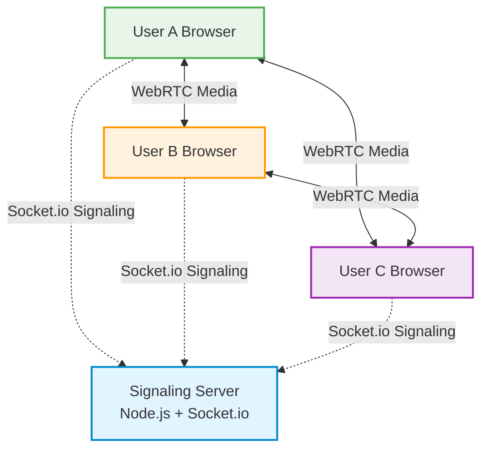
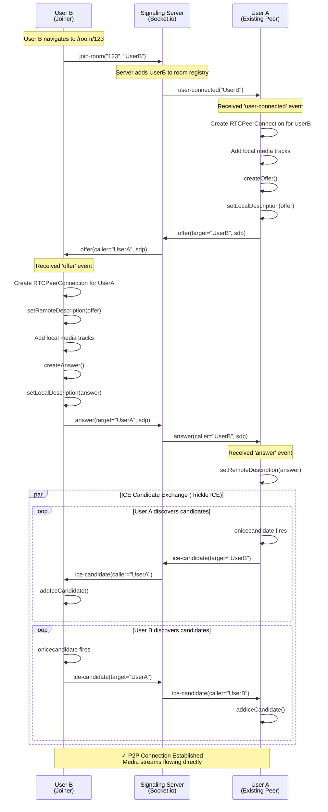

# Architecture Documentation

## Table of Contents
- [System Overview](#system-overview)
- [Architecture Diagrams](#architecture-diagrams)
- [Component Architecture](#component-architecture)
- [Custom Hooks](#custom-hooks)
- [Data Flow](#data-flow)
- [Security Considerations](#security-considerations)
- [Scalability](#scalability)
- [Appendix](#appendix)

---

## System Overview

ConferCall implements a **Mesh Topology (Peer-to-Peer)** architecture for real-time video conferencing:

- **Signaling Layer**: A centralized Node.js/Socket.io server facilitates the initial WebRTC handshake, including SDP (Session Description Protocol) exchange and ICE (Interactive Connectivity Establishment) candidate negotiation.

- **Media Layer**: Video and audio streams flow directly between peers using WebRTC peer connections. No media data passes through the server, ensuring low latency and high quality.

- **Frontend Layer**: A React application manages application state, user interface rendering, and media stream orchestration.

---

## Architecture Diagrams

### High-Level Architecture

The following diagram illustrates the mesh topology where each peer maintains direct connections with all other peers:



**Key Characteristics:**
- Dashed lines represent signaling messages (WebSocket/Socket.io)
- Solid lines represent direct peer-to-peer media streams (WebRTC)
- Each peer connects to every other peer (N×(N-1)/2 total connections)

---

### Signaling Flow (Connection Establishment)

This sequence diagram demonstrates the complete signaling flow when User B joins a room where User A is already present:



**Flow Breakdown:**

1. **Room Join**: User B emits a `join-room` event to the signaling server
2. **Peer Discovery**: Server notifies User A about the new peer
3. **Offer Creation**: User A (initiator) creates and sends an SDP offer
4. **Answer Creation**: User B processes the offer and responds with an answer
5. **ICE Exchange**: Both peers exchange network candidates concurrently
6. **Connection**: Once optimal candidates are found, media flows peer-to-peer

---

## Component Architecture

### Frontend Components

#### 1. **App.jsx**
**Responsibility**: Application routing and navigation management

- Configures React Router with route definitions
- Manages navigation between RoomSetup and VideoRoom components
- Provides application-wide context (if applicable)

#### 2. **RoomSetup.jsx**
**Responsibility**: Entry point and room creation/joining interface

- Landing page for new and returning users
- Generates UUID for new meeting rooms
- Provides input form for joining existing rooms by ID
- Validates room IDs before navigation

#### 3. **VideoRoom.jsx**
**Responsibility**: Main call container and state orchestration

- **Lobby State Management**: Conditionally renders `Lobby` component or the main call interface
- **Media Initialization**: Initializes `useMediaStream` hook for camera/microphone access
- **WebRTC Setup**: Initializes `useWebRTC` hook for peer connection management
- **UI Composition**: Renders grid layout of `VideoPlayer` components
- **Controls**: Renders `Controls` component for call actions
- Manages overall call state and coordinates between hooks

#### 4. **Lobby.jsx**
**Responsibility**: Pre-call verification and setup screen

- Device selection interface (camera/microphone)
- Live media preview before joining
- Username input and validation
- "Join Call" trigger that initializes WebRTC connections
- Ensures users verify their setup before entering the call

#### 5. **LandingPage.jsx**
**Responsibility**: Marketing and first-impression interface

- Professional entry point with branding
- Call-to-action buttons for creating/joining meetings
- Feature highlights and value proposition
- Routes users to appropriate setup screens

#### 6. **VideoPlayer.jsx**
**Responsibility**: Individual video stream rendering

- Displays `<video>` element with attached MediaStream
- Implements "mirror" effect for local user preview
- Shows participant labels and metadata
- Displays mute/unmute status indicators
- Handles video aspect ratio and responsive sizing

#### 7. **Chat.jsx**
**Responsibility**: Real-time text communication

- Integrated messaging interface within the video room
- Synchronized chat history using Socket.io
- Support for room-wide broadcasts
- Auto-scrolling and unread message indicators

#### 8. **SettingsModal.jsx**
**Responsibility**: Device and preference management

- Persistent modal for switching audio/video sources
- Live preview for selected devices before applying
- Minimalist UI that doesn't obstruct the call experience
- Integrated with browser's MediaDevices API

#### 9. **Controls.jsx**
**Responsibility**: Call control interface

- Floating action bar with primary controls
- **Basic Controls**: Mute/unmute audio, enable/disable video, copy meeting link, end call
- **Host Controls**: Kick participant and remote mute buttons (host only)
- **Recording Control**: Local screen recording using MediaRecorder API
- **Responsive Design**: Scale-aware layout optimized for mobile devices
- Real-time status indicators for active features

---

### Custom Hooks

#### 1. **useMediaStream.js**
**Responsibility**: Local media device management

- Wraps `navigator.mediaDevices.getUserMedia()` API
- Manages local `MediaStream` state
- Provides `toggleAudio()` function to enable/disable microphone
- Provides `toggleVideo()` function to enable/disable camera
- Handles device permission errors gracefully
- Cleans up streams on unmount

**Key Features:**
- Automatic cleanup of media tracks
- Error handling for permission denials
- Support for device switching
- Track-level enable/disable (preserves stream)

#### 2. **useAudioLevel.js**
**Responsibility**: Real-time audio visualization

- Processes raw audio tracks using Web Audio API
- Analyzes frequency data for active speaker detection
- Provides normalized audio level values for UI components
- Optimizes performance by limiting analysis frequency

#### 3. **useWebRTC.js**
**Responsibility**: WebRTC connection orchestration (Core Logic Hub)

- **Socket.io Management**: Establishes and maintains WebSocket connection
- **Peer Connection Registry**: Manages dictionary of `RTCPeerConnection` objects via `peersRef`
- **Signaling Handlers**: Processes `offer`, `answer`, and `ice-candidate` events
- **State Management**: Implements `shouldJoin` flag to defer connections until lobby completion
- **Stream Management**: Exposes `peers` state (dictionary mapping peer IDs to remote MediaStreams)
- **Connection Lifecycle**: Handles peer connection, disconnection, and cleanup

**Architecture Decisions:**
- Uses `useRef` for RTCPeerConnection storage (prevents unnecessary re-renders)
- Uses `useState` for MediaStream storage (triggers UI updates)
- Implements "initiator" pattern where existing peers offer to new joiners
- Handles ICE candidate buffering before remote description is set

---

## Data Flow

### 1. Initialization Flow

```
VideoRoom Mounts
    ↓
Request Camera/Microphone (useMediaStream)
    ↓
Local Stream Obtained
    ↓
useWebRTC Hook Mounts
    ↓
Socket.io Connection Established
    ↓
Emit 'join-room' Event
    ↓
Wait for user-connected events
```

### 2. New Peer Connection Flow

```
'user-connected' Event Received
    ↓
useWebRTC Creates New RTCPeerConnection
    ↓
Add Local Stream Tracks to Connection
    ↓
Create and Send SDP Offer
    ↓
Receive SDP Answer
    ↓
Exchange ICE Candidates
    ↓
Connection Established
    ↓
Remote Stream Added to 'peers' State
    ↓
VideoRoom Re-renders with New VideoPlayer
```

### 3. Media Rendering Flow

```
Remote MediaStream Received
    ↓
Added to 'peers' State Object
    ↓
React Re-renders VideoRoom
    ↓
New VideoPlayer Component Created
    ↓
MediaStream Attached to <video> Element
    ↓
Video/Audio Plays Automatically
```

### 4. Local Recording Flow

```
User Clicks Record Button in Controls
    ↓
handleToggleRecording() Invoked
    ↓
navigator.mediaDevices.getDisplayMedia()
    ↓
User Selects Screen/Window to Capture
    ↓
MediaRecorder Initialized with Display Stream
    ↓
Recording Chunks Stored in Memory
    ↓
User Stops Recording
    ↓
MediaRecorder 'onstop' Event Fires
    ↓
Chunks Combined into Blob
    ↓
Create Object URL from Blob
    ↓
Programmatic <a> Click for Download
    ↓
File Saved as .webm Locally
```

---

## Security Considerations

### Transport Security

- **HTTPS Requirement**: WebRTC mandates HTTPS (or localhost) for `getUserMedia()` access
- **Production SSL**: SSL/TLS certificates are mandatory for production deployments
- **Media Encryption**: WebRTC streams are encrypted by default using DTLS (Datagram Transport Layer Security) and SRTP (Secure Real-time Transport Protocol)

### Signaling Security

- **Current State**: Socket.io signaling is currently open; anyone with a Room ID can join
- **Production Recommendations**:
  - Implement JWT-based authentication tokens
  - Add room password protection
  - Implement rate limiting on room creation
  - Add participant approval mechanisms
  - Log and monitor suspicious activities

### Data Privacy

- **Peer-to-Peer**: No media data passes through server (privacy by design)
- **Local Recording**: Recordings stored locally on user's device
- **Metadata**: Server only handles connection metadata, not content

---

## Scalability

### Current Architecture: Mesh Topology

**Optimal Range**: 2-4 participants

**Bandwidth Characteristics**:
- Each peer maintains N-1 connections (where N = total participants)
- Each peer uploads their stream N-1 times
- Total connections in room: N×(N-1)/2

**Example**:
- 3 participants = 3 connections, 2 uploads per peer
- 5 participants = 10 connections, 4 uploads per peer
- 10 participants = 45 connections, 9 uploads per peer

**Limitations**:
- Client upload bandwidth becomes bottleneck
- CPU usage increases with encoding/decoding streams
- Mobile devices struggle with 5+ peers

### Future Scaling Strategies

#### Option 1: SFU (Selective Forwarding Unit)
**Recommended for**: 5-50 participants

- Each peer sends one stream to server
- Server forwards to other peers selectively
- Reduces client upload bandwidth to 1 stream
- Examples: Mediasoup, Jitsi, Janus

#### Option 2: MCU (Multipoint Control Unit)
**Recommended for**: Large conferences (50+ participants)

- Server mixes all streams into one composite
- Each peer receives single mixed stream
- Highest server CPU requirement
- Best client bandwidth efficiency

#### Option 3: Hybrid Architecture
- Mesh for small groups (<5)
- Automatic SFU promotion for larger groups
- Best user experience across scales

---

## Appendix

### High-Fidelity Diagram Generation Prompt

To generate professional visual representations of this architecture using advanced diagramming tools (Mermaid, Draw.io, Lucidchart), use the following detailed prompt:

> **ConferCall System Architecture Visualization Prompt**
> 
> **Role**: Act as a Senior Solutions Architect with expertise in real-time communication systems.
> 
> **Objective**: Generate a detailed, production-grade sequence diagram illustrating the complete "Join and Connect" flow for a P2P WebRTC video conferencing application.
> 
> **Scenario**: User B joins an active meeting room where User A is already present.
> 
> **Required Entities**:
> 1. **User B (Joining Client)**
>    - Show UI state transitions: `LandingPage` → `Lobby` (device preview) → `VideoRoom` (active call)
>    - Include local state changes (username, device selection)
> 
> 2. **User A (Existing Participant)**
>    - Already in `VideoRoom` state
>    - Acts as WebRTC connection initiator
> 
> 3. **Signaling Server**
>    - Socket.io message relay hub
>    - Room state management
>    - Connection brokering
> 
> 4. **Display Media API**
>    - Represents browser's screen capture capability
>    - Used for local recording feature
> 
> **Required Flow Coverage**:
> 
> 1. **Lobby Phase**
>    - User B verifies camera/microphone functionality
>    - Username input and local state initialization
>    - Device permission handling
> 
> 2. **Join Event**
>    - User B clicks "Join Call" button
>    - Triggers `join-room` emission to signaling server
>    - Server updates room registry
> 
> 3. **Peer Discovery**
>    - Server broadcasts `user-connected` event to User A
>    - User A receives new peer notification
> 
> 4. **SDP Handshake**
>    - User A creates RTCPeerConnection object
>    - User A generates SDP offer with `createOffer()`
>    - Offer relayed through server to User B
>    - User B creates RTCPeerConnection object
>    - User B generates SDP answer with `createAnswer()`
>    - Answer relayed through server to User A
> 
> 5. **ICE Candidate Exchange (Trickle ICE)**
>    - Both peers discover network candidates asynchronously
>    - Candidates exchanged through signaling server
>    - Show concurrent bidirectional flow
>    - Include candidate types (host, srflx, relay)
> 
> 6. **P2P Connection Established**
>    - Show transition from signaling to direct media flow
>    - Illustrate WebRTC data channel activation
>    - Display media stream rendering in UI
> 
> 7. **Recording Feature**
>    - User A triggers local recording
>    - Browser invokes `getDisplayMedia()` API
>    - MediaRecorder processes composite stream
>    - Show local file download on recording stop
> 
> **Styling Requirements**:
> - Use modern, professional color palette (blues, greens, purples)
> - Clear activation boxes for each state change
> - Descriptive notes for every WebRTC API call:
>   - `createOffer()`, `createAnswer()`
>   - `setLocalDescription()`, `setRemoteDescription()`
>   - `addIceCandidate()`, `addTrack()`
> - **Line Style Distinctions**:
>   - Dashed lines for signaling messages (Socket.io)
>   - Thick solid lines for P2P media flows (WebRTC)
>   - Dotted lines for browser API interactions
> - Include timing annotations where critical (e.g., "ICE gathering: ~2-3s")
> - Add error handling paths (permission denied, connection timeout)
> 
> **Output Format**: Mermaid.js sequence diagram (compatible with GitHub, Notion, and markdown renderers)
> 
> **Additional Context**: This diagram will be used for technical documentation, architecture reviews, and onboarding new developers to the WebRTC codebase.

---

### Technology Stack Reference

| Layer | Technology | Purpose |
|-------|-----------|---------|
| Frontend Framework | React 18 | UI rendering and state management |
| Styling | Tailwind CSS | Utility-first styling |
| Icons | Lucide React | Icon components |
| Routing | React Router v6 | Client-side routing |
| Real-time Communication | WebRTC Native API | Peer-to-peer media streaming |
| Signaling Protocol | Socket.io Client | WebSocket-based signaling |
| Backend Server | Node.js + Express | Signaling server runtime |
| WebSocket Server | Socket.io | Real-time bidirectional communication |
| Utilities | UUID | Unique room ID generation |

---

### WebRTC Configuration

```javascript
// ICE Server Configuration
const iceServers = [
  { urls: 'stun:stun.l.google.com:19302' },
  { urls: 'stun:stun1.l.google.com:19302' },
  { urls: 'stun:stun2.l.google.com:19302' }
];

// RTCPeerConnection Configuration
const rtcConfig = {
  iceServers: iceServers,
  iceCandidatePoolSize: 10,
  bundlePolicy: 'max-bundle',
  rtcpMuxPolicy: 'require'
};
```

---

*Last Updated: December 2025*  
*Architecture Version: 1.0.1*  
*Maintained by: ConferCall Development Team*